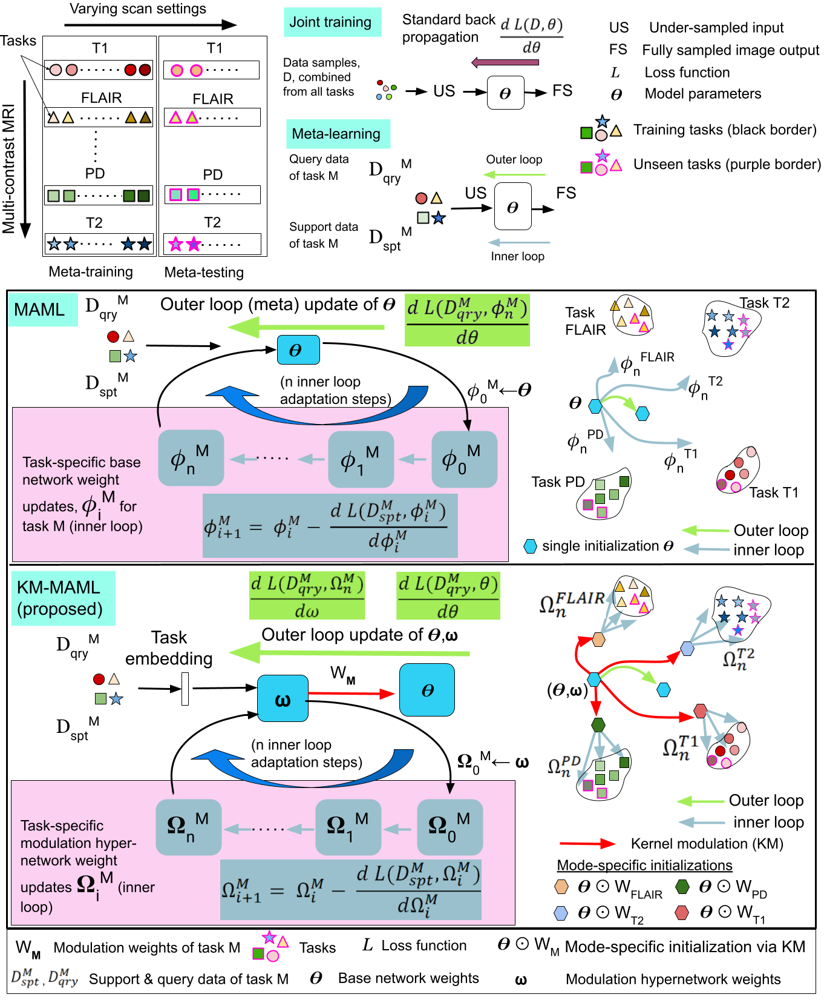

# Hybrid meta-learning model for multi-modal MRI reconstruction
### *An hybrid meta-learning model for multi-modal MRI Reconstruction without retraining* 
> [Generalizing Supervised Deep Learning MRI Reconstruction to Multiple and Unseen Contrasts using Meta-Learning Hypernetworks]()  


Graphical abstract of MRI data sources and learning methods. Top left: Multimodal MRI data sources represented by various shapes and colors, each posed as a training task for the neural network. Top right: Joint training has a single level of optimization of the base network by combining the training samples from datasets acquired with diverse acquisition settings. Meta-learning has two levels of optimization - inner and outer. Each dataset corresponding to an acquisition setting is posed as a training task. Each task consists of support and query partitions of the dataset. The average loss with respect to a batch of tasks using the support data is back-propagated for a few gradient steps in the inner loop. For the outer loop backpropagation or meta weight update, the loss average loss with respect to a batch of tasks using the query data is used. 
Bottom left: Concept diagram of the bi-level optimization of MAML and KM-MAML. MAML involves bi-level optimization (gray arrows for the inner loop, and green arrows for the outer loop) of the base learner (blue box). Different from MAML, KM-MAML involves two networks - a base learner for reconstruction and an auxiliary network called the kernel modulation (KM) network. The two levels of optimization are 1) outer loop or meta-weight updates of the base network θ and the KM network ω shown as green arrows backward. 2) The inner loop or task-specific adaptation via a few gradient updates of the KM network (gray arrows within the pink box). The meta-parameters of the KM network infuse task-specific knowledge to the base learner via kernel modulation to create an improved base learner. (Bottom Right) Weight update process in the task space. KM-MAML provides mode-specific initializations (red arrows pointing to multi-colored hexagons) that coarsely capture the target MRI data distribution, unlike MAML which has a single meta-initialization. Fine-tuning by a few gradient steps (gray arrows) refines the model closer to the target data distribution.

## Dependencies
#### Packages
* *PyTorch*
* *TensorboardX*
* *numpy*
* *tqdm*
 
An exhaustive list of packages used could be found in the *requirements.txt* file. Install the same using the following command:

```bash
 conda create --name <env> --file requirements.txt
```

## Folder hierarchies 

Folder hierarchy to set up datasets (input, label pairs)
--------------------------------------------------------

Each Acquisition context has three settings - DATASET_TYPE, MASK_TYPE and acceleration factor represented in short ACC_FACTOR

DATASET_TYPE indicates the different types of anatomy images that we would like to combine in a single training
MASK type indicates the kind of mask pattern which we use in the training. 
ACC_FACTOR - the acceleration factor for reconstruction 

<base_path>/datasets/DATASET_TYPE/MASK_TYPE/ACC_FACTOR/<train_support, train_query, validation_support and validation_query folders>

Example:
For example, 1. if we intend to combine T1 and FLAIR as two different data types of a subject then we could set this as DATASET_TYPE folders are 'mrbrain_t1' and'mrbrain_flair'. 2. if we use two mask types - Cartesian and Gaussian, then MASK_TYPE folders are cartesian, gaussian. 3. If we intend combining three acceleration factors, 4x, 5x and 8x, then ACC_FACTOR folders are acc_4x, acc_5x and acc_8x.
For these settings the folder hierarchy is as follows:


											      datasets
						seen contrasts					|                       unseen contrasts
							------------------------------------------------------------------------
							|									|
						mrbrain_t1, mrbrain_flair, ixi_pd, ixi_t2			sri24_t1, sri24_t2, sri24_pd
							|									|
					-------------------------						---------------------------------
					|			|					        |				|
				    cartesian	         gaussian					     cartesian			     gaussian
				      |			   |					                |				|
		train, validation(support, query) train, validation (support, query)            train, validation(support, query)    train, validation(support, query)
		----------------		----------------			                ---------------			-----------------
                |	|	|		|	|	|					|	|	|	   	|	|	|
	     acc_4x  acc_5x   acc_8x	     acc_4x  acc_5x   acc_8x		                  acc_6x, acc_7x, acc_9x, acc_10x      acc_6x  acc_7x	acc_10x


The folder hierarchy for the under-sampling masks are stored in a folder seperately as follows.
<base_path>/us_masks/DATASET_TYPE/MASK_TYPE/mask_<ACC_FACTOR>.npy

For example, to stored the 4x mask for Gaussian mask type for MRBrains FLAIR is stored as follows.

<base_path>/us_masks/mrbrain_t1/gaussian/mask_4x.npy

Note that if the mask is made on the fly for a given mask type and acceleration factor, then accordingly the changes needs to be done in dataset.py to generate random mask and based on that generate the under-sampled images. In that case, mask need not be stored.


Folder hierarchy for experiments folder
----------------------------------------

The hierarchy is similar to the one for datasets but in the experiments/<model_name>/results folder

<base_path>/experiments/<model_name>/results/DATASET_TYPE/MASK_TYPE/ACC_FACTOR

<model_name> - this is the folder with the model name in which the model files are stored.
results - this is the folder in which all the predicted test files are stored in .h5 format for each acquisition context.

## Train code 

```bash
sh train_combinedall.sh
```

## Test code 

```bash
sh valid_combinedall.sh
```

## Evaluate PSNR / SSIM metrics 

```bash
sh evaluate_combinedall.sh
```

## Display PSNR / SSIM metrics 

```bash
sh report_collect_combinedall.sh
```

